# 導入手順書

- [導入手順書](#導入手順書)
  - [概要](#概要)
  - [前提条件](#前提条件)
  - [プラグイン導入手順](#プラグイン導入手順)
    - [Stripe ダッシュボードで EC-CUBE を設定](#stripe-ダッシュボードで-ec-cube-を設定)
    - [EC-CUBE 管理画面で Stripe 決済プラグインを導入](#ec-cube-管理画面で-stripe-決済プラグインを導入)
    - [プラグインの有効化](#プラグインの有効化)
  - [プラグインの設定](#プラグインの設定)
  - [トラブルシューティング](#トラブルシューティング)
    - [手動でプラグインを無効化する方法](#手動でプラグインを無効化する方法)
  - [アンインストール手順](#アンインストール手順)
  - [よくある質問](#よくある質問)
    - [Q：注文金額を変更（増額）可能でしょうか](#q注文金額を変更増額可能でしょうか)
    - [Q:「ご注文手続き」画面に「Stripe決済は現在準備できていません」と表示されます。](#qご注文手続き画面にstripe決済は現在準備できていませんと表示されます)
  - [参考情報](#参考情報)

---

## 概要

本手順書は、EC-CUBE に Stripe 決済プラグインを導入する手順について説明します。

---

## 前提条件

プラグインを導入する前に、以下の条件を満たしていることを確認してください。

-   **EC-CUBE バージョン**:
    導入するプラグインが対応しているバージョンであること。
-   **Stripe アカウント**:
    Stripe ダッシュボードにアクセスできること。
-   **Stripe API**:
    利用 API バージョンが 2024-06-20 以降 2025-10-29.clover までであること。
-   **SSL**:
    SSL 通信が可能であること。

---

<div style="page-break-before:always"></div>

## プラグイン導入手順

### Stripe ダッシュボードで EC-CUBE を設定

<p style="font-size: 14px; margin: 0;">※ テスト環境におけるインストールと確認を推奨します。</p>

1. [Stripe APP MARKETPLACE](https://marketplace.stripe.com/) にアクセスします。
2. **EC-CUBE** を検索し、**Install app**をクリックします。

<div style="border: 1px solid #ccc; padding: 4px; display: inline-block;">
  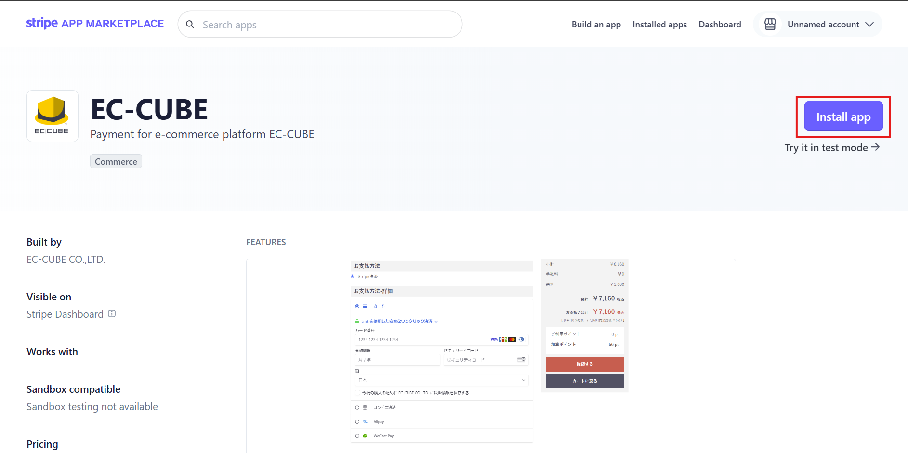
</div>

<div style="page-break-before:always"></div>

3. インストール先を選択し、**Install app in XX mode**をクリックします。

※Live mode の場合はアカウントで[本番環境の申請](https://docs.stripe.com/get-started/account/activate?locale=ja-JP)が必要です。

<div style="border: 1px solid #ccc; padding: 4px; display: inline-block;">
  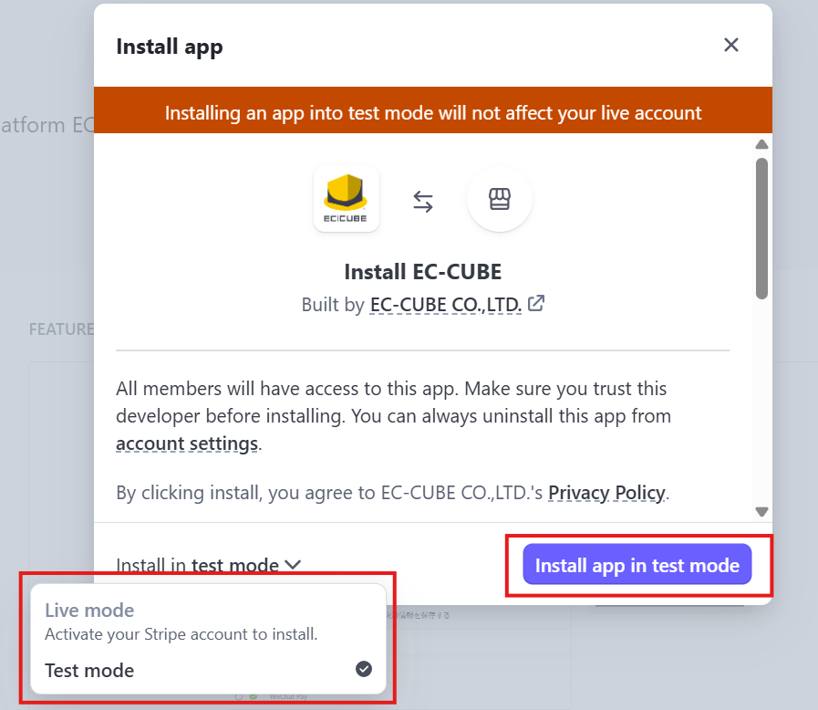
</div>

<div style="page-break-before:always"></div>

4. INSTALL が完了したら、**Conbinue to app settings**をクリックします。

<div style="border: 1px solid #ccc; padding: 4px; display: inline-block;">
  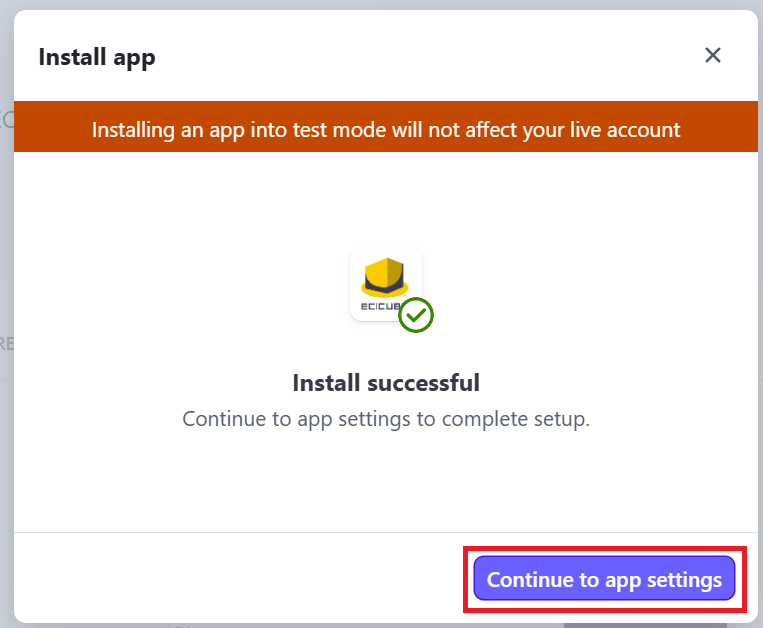
</div>

<div style="page-break-before:always"></div>

5. **「API キー」** より **公開可能キー** と **制限付きキー** をメモしておきます。

※表示されない場合は、右上の API キーの表示より確認可能です。

<div style="border: 1px solid #ccc; padding: 4px; display: inline-block;">
  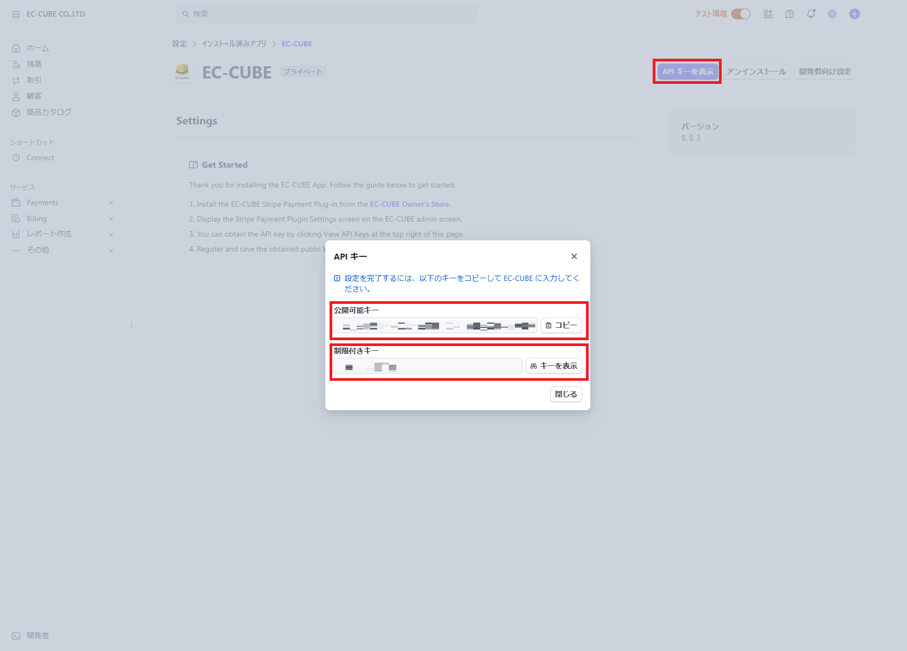
</div>

<div style="page-break-before:always"></div>

### EC-CUBE 管理画面で Stripe 決済プラグインを導入

1. **EC-CUBE 管理画面** にログインします。
2. 左メニューから **「オーナーズストア → プラグイン → プラグインを探す」** を選択します。
3. **「Stripe 決済プラグイン」** を検索し、**「入手する」** ボタンをクリックします。
4. **「インストール」** ボタンをクリックします。
5. インストール後、プラグイン一覧に表示されることを確認します。

### プラグインの有効化

1. **プラグイン一覧** 画面で追加したプラグインを探します。
2. **「有効化」** ボタンをクリックします。

<div style="border: 1px solid #ccc; padding: 4px; display: inline-block;">
  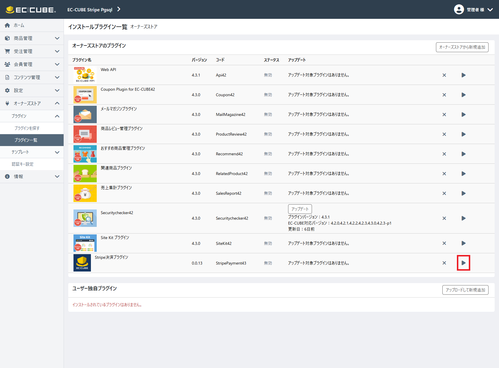
</div>

3. トップページや管理画面をリロードし、正常に動作しているか確認します。

---

<div style="page-break-before:always"></div>

## プラグインの設定

1. プラグイン一覧より設定画面を表示します。

<div style="border: 1px solid #ccc; padding: 4px; display: inline-block;">
  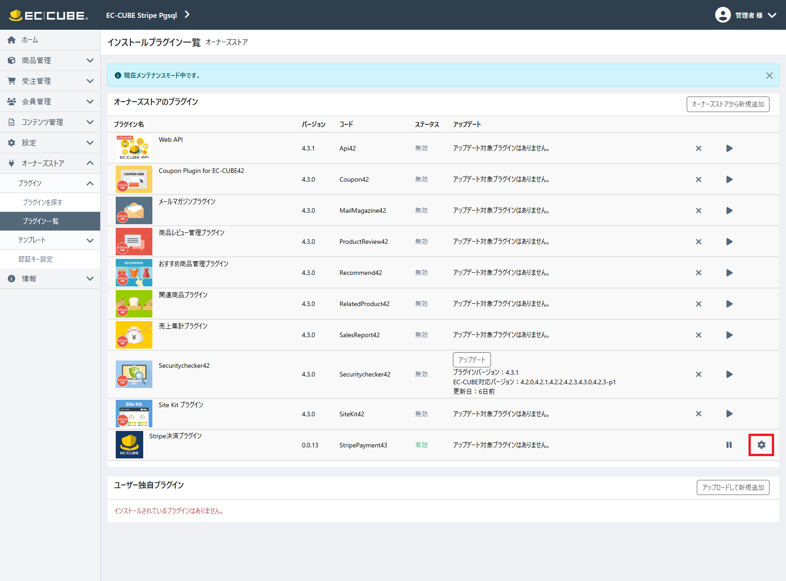
</div>

2. 設定を行い登録ボタンを押下します。

<div style="border: 1px solid #ccc; padding: 4px; display: inline-block;">
  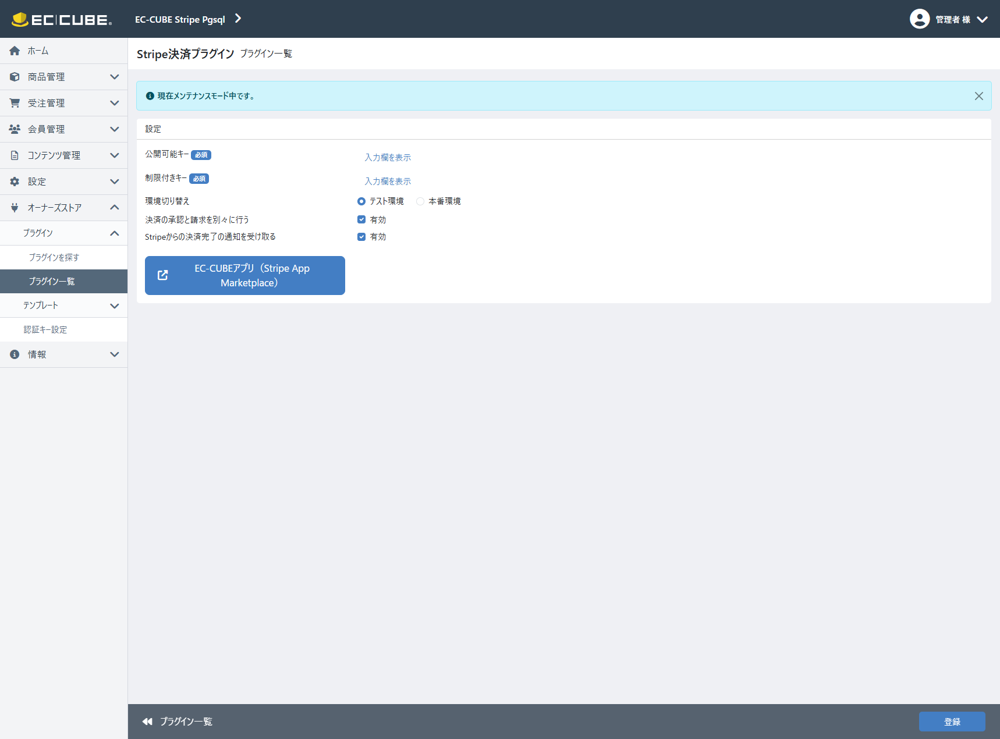
</div>

-   **公開可能キー**: Stripe との通信に必要な API キー。
-   **制限付きキー**: Stripe との通信に必要な API キー。
-   **決済の承認と請求を別々に行う**:
    -   有効化すると、購入時にはオーソリ（承認）のみを行い、キャプチャ（請求）を別のタイミングで実施できます。
    -   この場合、請求は Stripe のダッシュボードから、または API 呼び出しによって行います。
-   **Stripe からの決済完了の通知を受け取る**:
    -   有効化すると、決済情報が Stripe の Webhook を通じて自動更新されます。<span style="color: red; font-weight: 700;">（推奨）</span>
    -   無効化すると、決済の状態にかかわらず、対応状況ステータスは「新規受注」、決済状況ステータスは「未決済」となります。また、自動更新は行われなくなるため、ステータスは手動で変更する必要があります。
    -   **エラー発生時の対処**: Webhook の問題が発生した場合は、Stripe ダッシュボードでエンドポイントを削除後、無効化・有効化を行って再登録してください。
    -   <span style="color: red; font-weight: 700;">1.0.2以前のバージョンをご利用の場合、「対応状況ステータス」の変更ができなくなるため、必ず「有効」に設定してください。</span>

3. **「設定 → 店舗設定 → 支払方法設定」** で **「Stripe 決済」** を有効化します。

<div style="border: 1px solid #ccc; padding: 4px; display: inline-block;">
  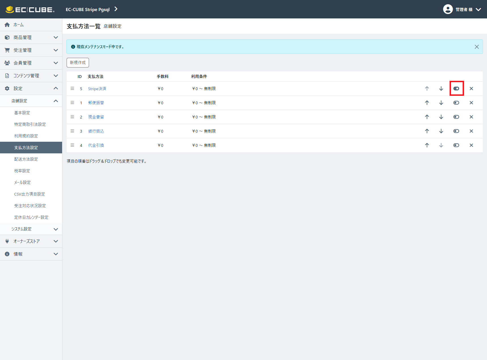
</div>

4. **「設定 → 店舗設定 → 配送方法設定」** で Stripe 決済を利用可能な配送業者を選択し、**「取り扱う支払方法」** の **「Stripe 決済」** を有効化します。

<div style="border: 1px solid #ccc; padding: 4px; display: inline-block;">
  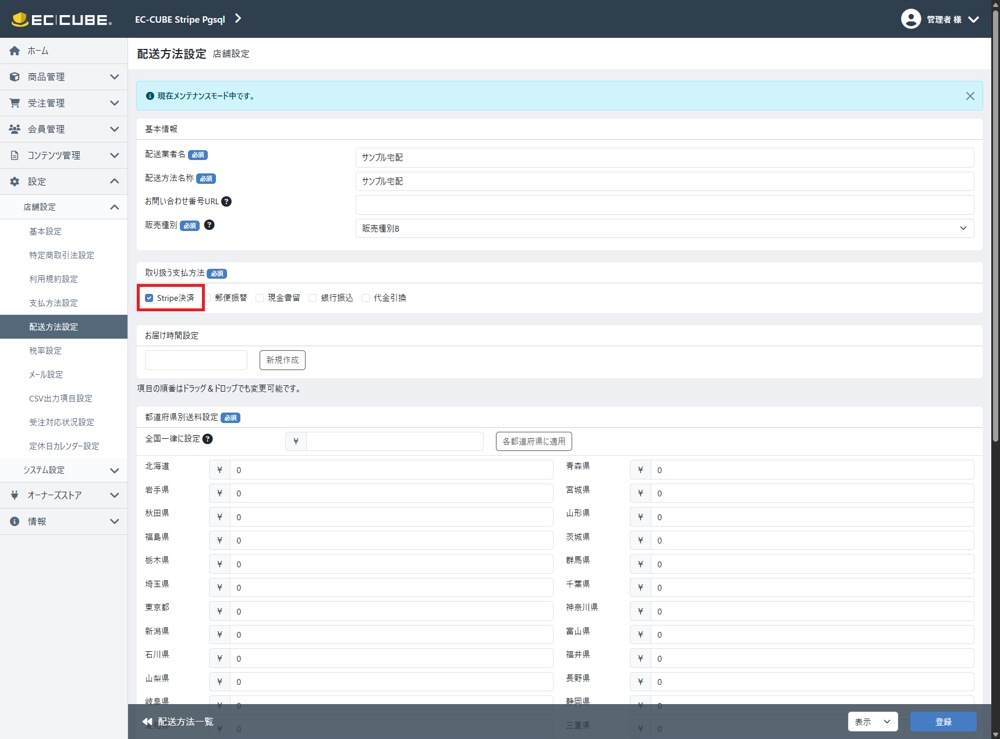
</div>

5. フロントエンドおよび管理画面で正常に動作していることを確認します。

---

<div style="page-break-before:always"></div>

## トラブルシューティング

| 問題                         | 解決方法                                                             |
| ---------------------------- | -------------------------------------------------------------------- |
| プラグインが表示されない     | キャッシュをクリアし、管理画面を再読み込みしてください。             |
| インストールに失敗する       | プラグインの対応バージョンを確認してください。                       |
| 管理画面が動作しない         | プラグインを手動で無効化し、システムを復元してください。             |
| 特定の機能のみ動作しない場合 | Stripe の API バージョンを 2024-06-20 バージョンに変更してください。 |

### 手動でプラグインを無効化する方法

1. サーバーに SSH または FTP で接続します。
2. 以下のディレクトリに移動し、対象プラグインのフォルダ名を変更します。

```bash
mv /app/Plugin/StripePayment43 /app/Plugin/StripePayment43_backup
```

3. EC-CUBE のキャッシュをクリアします。

```bash
php bin/console cache:clear
```

---

<div style="page-break-before:always"></div>

## アンインストール手順

1. **EC-CUBE 管理画面** → **「プラグイン管理」** を開きます。
2. 該当プラグインの **「無効化」** をクリックします。

<div style="border: 1px solid #ccc; padding: 4px; display: inline-block;">
  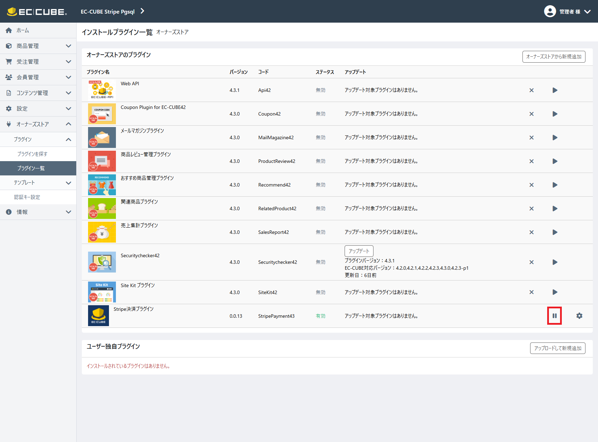
</div>

3. **「削除」** ボタンをクリックし、プラグインを削除します。

<div style="border: 1px solid #ccc; padding: 4px; display: inline-block;">
  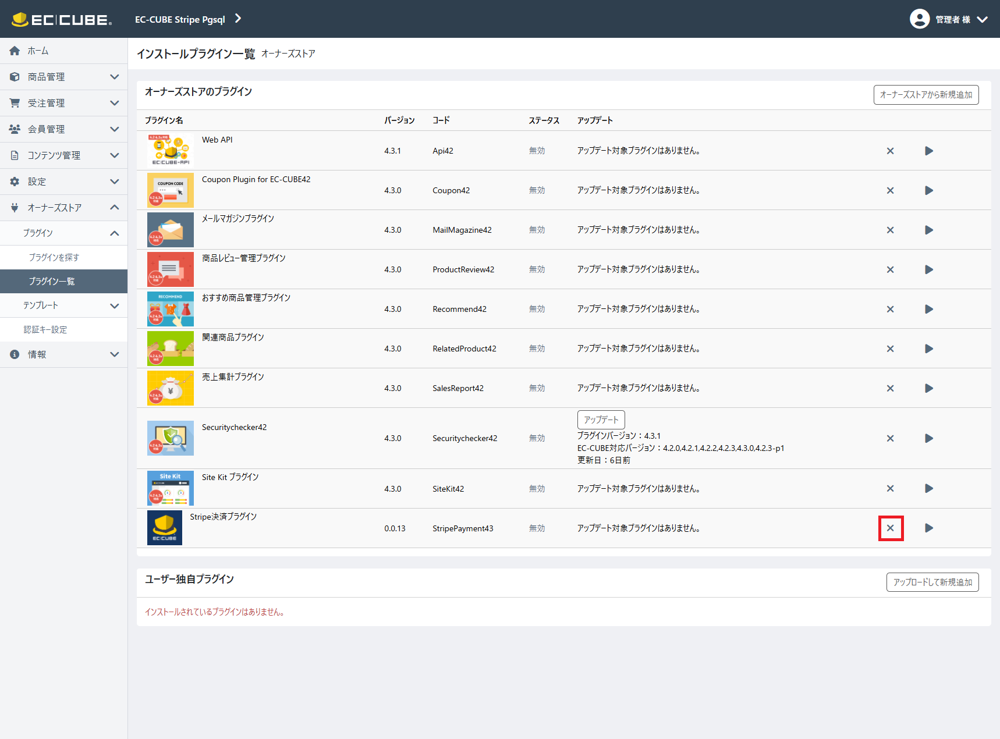
</div>

---

## よくある質問

### Q：注文金額を変更（増額）可能でしょうか

**A：変更できません。**  
**「決済の承認と請求を別々に行う」設定が ON**の場合に限り、**決済額の変更（減額のみ）** は Stripe ダッシュボード上で実施可能です。
また、**「Stripe からの決済完了の通知を受け取る」設定が ON**になっていれば、減額分は「一部返金」として処理されます。


### Q：「ご注文手続き」画面に「Stripe決済は現在準備できていません」と表示されます。

**A1：EC-CUBEユーザがテスト用のStripe会員ID に紐づいているためです。**  
Stripeの会員IDは、本番とテストで別管理です。
テスト環境の会員に紐づいたまま本番モードで決済しようとすると、本番側に顧客が存在しないため上記メッセージが表示されます。

**【確認方法】**
1. EC-CUBE 管理画面 → 会員管理 → 会員一覧 で該当ユーザを開く。
2. 「Stripe 会員 ID」 のリンクをクリックして Stripe ダッシュボードを開く。
3. ダッシュボード上のモードが「テスト」になっていれば、当該ユーザはテスト環境の会員に紐づいています（本番では未登録）

**【対応方法】**
* 本番環境用とテスト環境用で、それぞれ別のユーザを作成して確認いただくことをお勧めいたします。

**A2：URL リライト／マッピングで「実ディレクトリを隠している」場合、内部 API への到達に失敗し表示されます。**  

**【対応方法】**
* リライト（Rewrite/try_files 等）で、下記エンドポイントが 実ディレクトリのルーティングに到達 するよう除外（バイパス）設定を追加してください。

**エンドポイント一覧**
```
/mypage/stripe_payment_card_info
/mypage/stripe_payment_get_client_secret
/mypage/stripe_payment_card_delete/{paymentMethodId}
/get_stripe_public_key
/submit_stripe_shopping
/payment/callback
/payment/success
/payment/error
/stripe_payment/webhook
/%eccube_admin_route%/stripe_payment/config
/%eccube_admin_route%/stripe_payment/order/cancel/{id}
/%eccube_admin_route%/stripe_payment/order/change_price/{id}
/%eccube_admin_route%/order/bulk_change_payment_status
```
※%eccube_admin_route% は**管理画面＞システム設定＞セキュリティ管理＞管理画面URL**の値です。
※{paymentMethodId}／{id} は動的パラメータです。
※エンドポイントはバージョンにより変更される可能性があります。

---

## 参考情報

-   [EC-CUBE4 開発者向けドキュメント](https://doc4.ec-cube.net/)
