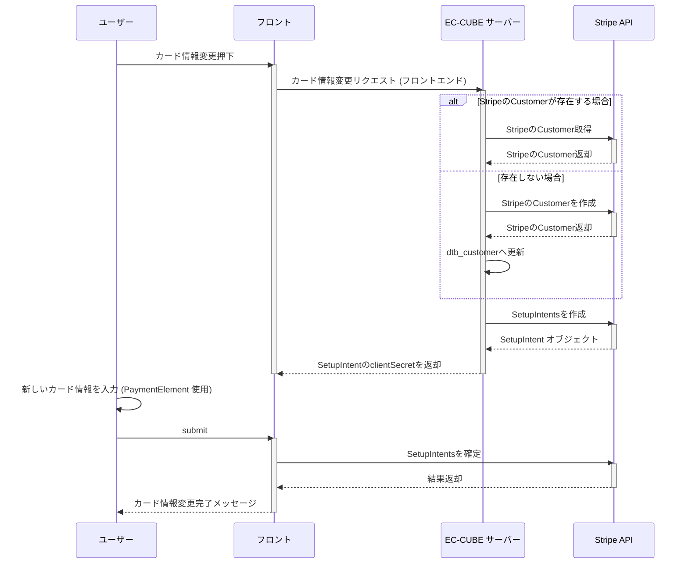

- [将来の支払いを設定する](https://docs.stripe.com/payments/save-and-reuse)

## シーケンス図 (Mermaid 記法)

```mermaid
sequenceDiagram
    participant User as ユーザー
    participant Front as フロント
    participant EC as EC-CUBE サーバー
    participant Stripe as Stripe API

    User ->> Front: カード情報変更押下
    activate Front
        Front ->> EC: カード情報変更リクエスト (フロントエンド)
        activate EC
            alt StripeのCustomerが存在する場合
                EC ->> Stripe: StripeのCustomer取得
                activate Stripe
                    Stripe -->> EC: StripeのCustomer返却
                deactivate Stripe
            else 存在しない場合
                EC ->> Stripe: StripeのCustomerを作成
                activate Stripe
                    Stripe -->> EC: StripeのCustomer返却
                deactivate Stripe
                EC ->> EC: dtb_customerへ更新
            end
                EC ->> Stripe: SetupIntentsを作成
            activate Stripe
                Stripe -->> EC: SetupIntent オブジェクト
            deactivate Stripe
            EC -->> Front: SetupIntentのclientSecretを返却
        deactivate EC
    deactivate Front
    User ->> User: 新しいカード情報を入力 (PaymentElement 使用)

    User ->> Front: submit
    activate Front
        Front ->> Stripe: SetupIntentsを確定
        activate Stripe
            Stripe -->> Front: 結果返却
        deactivate Stripe
        Front -->> User: カード情報変更完了メッセージ
    deactivate Front
```
