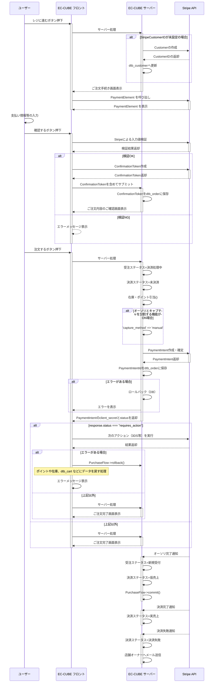

## シーケンス図 (Mermaid 記法)

```mermaid
sequenceDiagram
   participant User as ユーザー
   participant フロント as EC-CUBE フロント
   participant EC as EC-CUBE サーバー
   participant Stripe as Stripe API

   User ->> フロント: レジに進むボタン押下
   activate フロント
      フロント ->> EC: サーバー処理
      activate EC
         alt StripeCustomerIDが未設定の場合
            EC ->> Stripe: Customerの作成
            Stripe -->> EC: CustomerIDの返却
            EC ->> EC: dtb_customerへ更新
         end
         EC -->> フロント: ご注文手続き画面表示
      deactivate EC
      フロント ->> Stripe: PaymentElement を呼び出し
      activate Stripe
         Stripe -->> フロント: PaymentElement を表示
      deactivate Stripe
   deactivate フロント
   User ->> User: 支払い情報等の入力

   User ->> フロント: 確認するボタン押下
   activate フロント
      フロント ->> Stripe: Stripeによる入力値検証
      activate Stripe
         Stripe -->> フロント: 検証結果返却
      deactivate Stripe
      alt 検証OK
         フロント ->> Stripe: ConfirmationToken作成
         activate Stripe
            Stripe -->> フロント: ConfirmationToken返却
         deactivate Stripe
         フロント ->> EC: ConfirmationTokenを含めてサブミット
         activate EC
            EC ->> EC: ConfirmationTokenをdtb_orderに保存
            EC -->> フロント: ご注文内容のご確認画面表示
         deactivate EC
      else 検証NG
         フロント -->> フロント: エラーメッセージ表示
      end
   deactivate フロント

   User ->> フロント: 注文するボタン押下
   activate フロント
      フロント ->> EC: サーバー処理
      activate EC
         EC ->> EC: 受注ステータス=決済処理中
         EC ->> EC: 決済ステータス=未決済
         EC ->> EC: 在庫・ポイント引当()
         alt オーソリとキャプチャを分割する機能がON場合
            EC ->> EC: 'capture_method' => 'manual'
         end
         EC ->> Stripe: PaymentIntent作成・確定
         activate Stripe
            Stripe -->> EC: PaymentIntent返却
         deactivate Stripe
         EC ->> EC: PaymentIntentIdをdtb_orderに保存
         alt エラーがある場合
            EC ->> EC: ロールバック（DB）
            EC -->> フロント: エラーを表示
         end
         EC -->> フロント: PaymentIntentのclient_secretとstatusを返却
      deactivate EC
      alt response.status === "requires_action"
         フロント ->> Stripe: 次のアクション（3DS等）を実行
         Stripe -->> フロント: 結果返却
         alt エラーがある場合
            フロント ->> EC: PurchaseFlow->rollback()
            Note　over フロント: ポイントや在庫、dtb_cart などにデータを戻す処理
            フロント ->> フロント: エラーメッセージ表示
         else 上記以外
            フロント ->> EC: サーバー処理
            activate EC
               EC -->> フロント: ご注文完了画面表示
            deactivate EC
         end
      else 上記以外
            フロント ->> EC: サーバー処理
            activate EC
               EC -->> フロント: ご注文完了画面表示
            deactivate EC
      end
   deactivate フロント

   Stripe -->> EC: オーソリ完了通知
   activate EC
      EC ->> EC: 受注ステータス=新規受付
      EC ->> EC: 決済ステータス=仮売上
      EC ->> EC: PurchaseFlow->commit()
   deactivate EC

   Stripe -->> EC: 決済完了通知
   activate EC
      EC ->> EC: 決済ステータス=実売上
   deactivate EC

   Stripe -->> EC: 決済失敗通知
   activate EC
      EC ->> EC: 決済ステータス=決済失敗
      EC ->> EC: 店舗オーナーへメール送信
   deactivate EC
```
